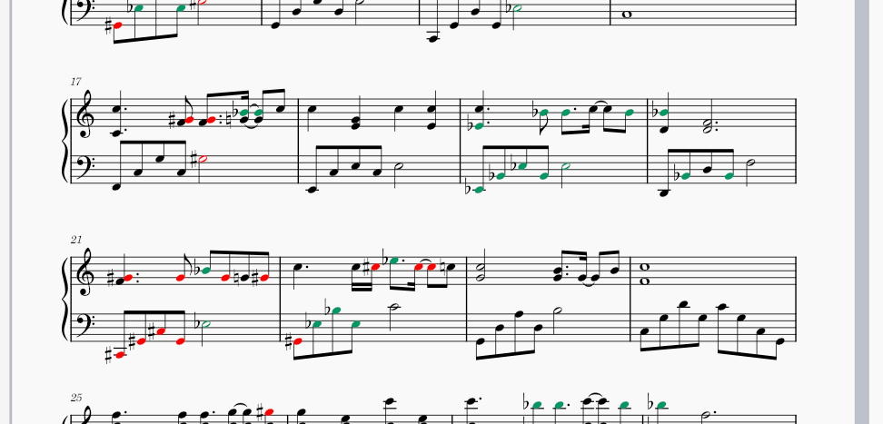

# MuseScore Plugin: Color Halfstep Notes Upgraded
musescore | piano | music

## Download

I modified a plugin that can paint all black key notes red. Now the plugin will paint sharp notes red and flat notes blue.

I just start learning playing piano. This plugin helps me reduce the mental burden to deal with different key signatures.

[Get the Plugin](https://github.com/Cracking-Sciences/Color-Halfstep-Notes-Upgraded)

## References

[MuseScore API Documentation](https://musescore.github.io/MuseScore_PluginAPI_Docs/plugins/html/index.html)

[The Original Plugin](https://musescore.org/en/project/color-all-half-step-notes-sharps-flats-red)