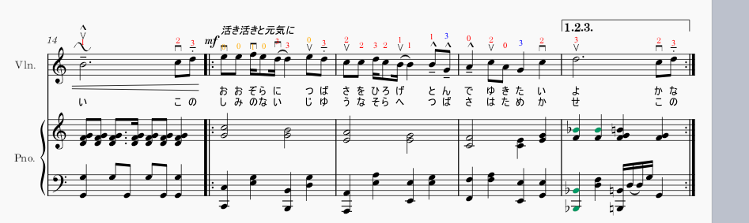
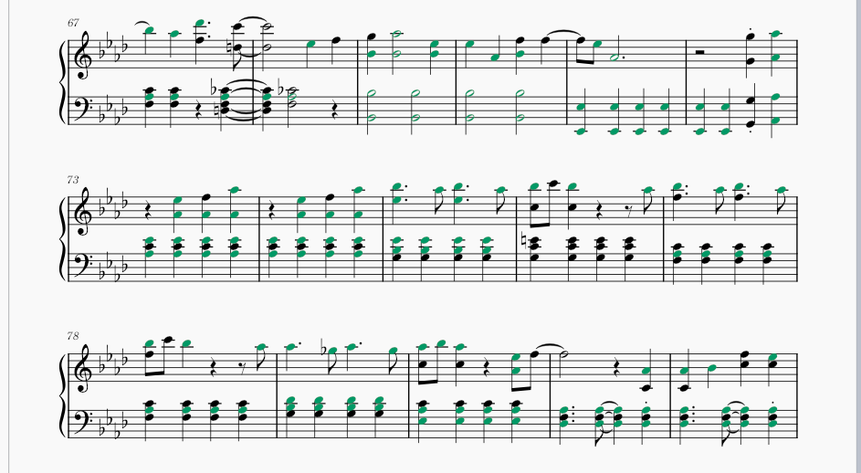
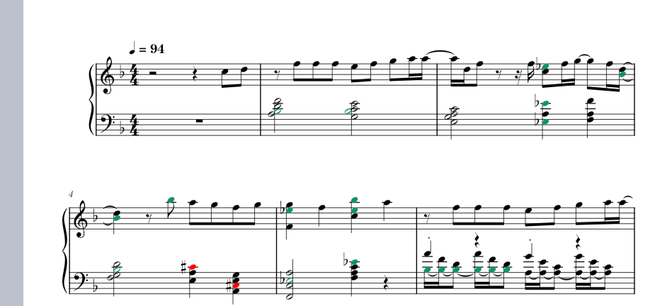

# Magic of the bVII or I7 chord
music | chords

我在很多悲伤的大调乐曲中听到了很有情感的li音(首调唱符, 亦降ti), 它贡献出了bVII或I7和弦(或者减掉一个音). 可以很寂寞, 也可以略有恍惚.如果它出现在lead中, 就会主导整段旋律的感情, 如果它出现在和弦中, 依然是一剂猛料, 学习一下. 

我忘了一些曲子, 之后再加上.

翼をください - 赤い鳥:

Pretender - Official髭男dism

優しい彗星 - YOASOBI

